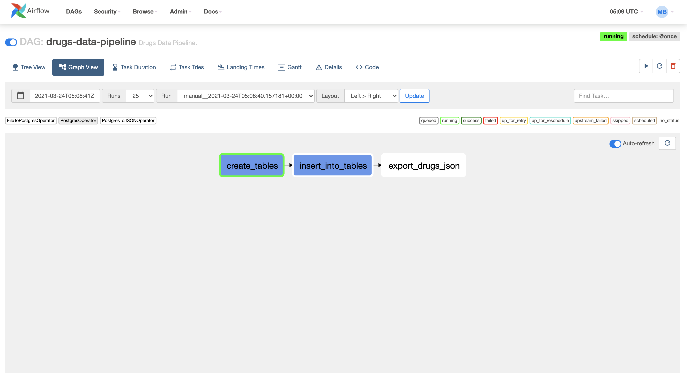

# Drugs Data Pipeline

## I. Description

Ce référentiel contient le code du projet Drugs Data Pipeline, développé en **Python 3.6** et destiné à fonctionner sur la plate-forme **Airflow 2.0**.

La solution consiste à *traiter des fichiers* (CSV et JSON) contenant des informations sur des médicaments et des publications associées afin de construire un **fichier JSON** qui représente un **graphe de liaison** entre les différents **médicaments** et leurs mentions respectives dans les **publications PubMed**, les différentes **publications scientifiques** et  les **journaux** avec la date associée à chacune de ces mentions.

La Data Pipeline suit les étapes suivantes:

1. **Création des tables** qui vont stocker les informations contenues dans les fichiers CSV et JSON;
2. **Traitement des fichiers** et **stockage des résultats** dans les tables créées précédemment;
3. **Récupération des données aggrégées** à travers une requête SQL;
4. **Construction et stockage** du graphe de liaison sous format JSON.

Ce processus est décrit à travers le graphe (DAG) suivant :


## II. Technologies utilisées

Ci-dessous une description générique des technologies utilisées pour la réalisation de ce projet :

| Technologie  | Description | Utilisation | version |
| ------------- | ------------- | ------------- | ------------- |
| [**GitHub**](https://github.com/) | Hébergement et versionning de code. | Hébergement du code de la solution. | - |
| [**Python**](https://www.python.org/) | Langage de programmation. | Développement de la Data Pipeline. | 3.6.1 |
| [**Pytest**](https://docs.pytest.org/en/stable/) | Librairie Python de tests. | Exécution des tests dans Google Cloud Build (CI). | 6.2.2 |
| [**Airflow**](https://airflow.apache.org/) | Création, planification et monitoring de workflow. | Orchestration de la Data Pipeline. | 2.0.1 |
| [**Docker**](https://www.docker.com/) | Logiciel de création et d'exécution de containers. | Packaging de la solution et préparation au déploiement.| 20.10.2 |
| [**Google Cloud Build**](https://cloud.google.com/build?hl=fr/) | Service CI/CD dans GCP. | Création de la chaine de CI/CD. | - |
| [**Google Container Registry**](https://cloud.google.com/container-registry?hl=fr) | Service d'hébergement de containers Docker dans GCP. | Hébergement des images Docker Airflow post-Build. | - |
| [**Google Kubernetes Engine (GKE)**](https://cloud.google.com/kubernetes-engine?hl=fr) | Service Kubernetes Managé par GCP | Déploiement des environnements Airflow. | - |
| [**Terraform**](https://helm.sh/) | Outil d'Infrastructure as Code. | Déploiement du Cluster Kubernetes dans GKE. | 0.14.8 |
| [**Helm**](https://helm.sh/) | Gestionnaire de packages Kubernetes. | Déploiement de la chart Airflow dans GKE. | 3.5.3 |

## III. Contenu du référentiel

Le référentiel contient un ensemble de répertoires et fichiers décrits ci-dessous :

    .
    ├── appendix                     # Réponses aux questions du test
    ├── cicd                         # Templates CI/CD
    ├── dags                         # Répertoire des workflows (DAGs) Airflow
        ├──  common                  # Modules communs réutilisables pour d'autres DAGs
        ├──  drugs_data_pipeline     # Code source de la Data Pipeline
    ├── img                          # Source d'images pour la documentation
    ├── Dockerfile                   # Fichier de création de l'image Docker
    ├── requirements.txt             # Liste de dépendances Python à installer
    ├── .gitignore                   # Fichiers à ignorer par Git

Pour chaque chaque répretoire ci-dessous, une documentation (README.md) est disponible :

- [```cicd/```](cicd/)
- [```dags/```](dags/)

## III. Déploiement

Le déploiement de la solution peut se faire :

- En local
- Sur [Google Cloud Platform (GCP)](https://cloud.google.com/)

### 1. Déploiement en local

Le déploiement de la solution passe par *4 étapes* indispensables :

**i.**      Installation des librairies Python
**ii.**     Installation de Airflow
**iii.**    Installation de PostgreSQL
**iv.**     Configuration de PostgreSQL dans Airflow

#### i. Installation des librairies Python

Les librairies Python à installer sont spécifiées dans le fichier ```requirerments.txt```.
Pour les installer, il suffit d'exécuter la commande suivante :

```bash
pip install -r requirements.txt
```

#### ii. Installation de Airflow

Il existe *2 façons simples* pour installer Airflow :

- En mode **Standalone** [```(lien)```](http://airflow.apache.org/docs/apache-airflow/stable/start/local.html)

- En utilisant **Docker** [```(lien)```](http://airflow.apache.org/docs/apache-airflow/stable/start/docker.html)

#### iii. Installation de PostgreSQL

PostgreSQL est utilisé comme moteur de base de données afin de stocker les données post-traitement.

PostgreSQL peut être installé :

- De façon indépendante, via **Docker** par exemple ([```lien```](https://hub.docker.com/_/postgres))

- En tant que **Backend** pour Airflow ([```lien```](https://airflow.apache.org/docs/apache-airflow/stable/howto/set-up-database.html))

> **N.B. :** Ne pas oublier de créer un user/password ainsi qu'une base de données associée.

#### iv. Configuration de PostgreSQL dans Airflow

Après installation et lancement de Airflow et PostgreSQL, il faudra configurer une **connexion** PostgreSQL dans Airflow.
Cela peut être fait à travers l'interface Airflow :

- Premièrement, dans l'onglet Admin en haut, aller dans **Connections** :


- Ensuite, cliquer sur l'icone **(+)** pour ajouter une connexion :


- Finalement, créer la connexion en spécifiant les **paramètres de connexion** au schéma (base de données) PostgreSQL :


> **IMPORTANT :** La valeur du champ "Conn ID" doit être identique à celle spécifiée dans le fichier de configuration [```dags/drugs_data_pipeline/config/config.py```](dags/drugs_data_pipeline/config/config.py)

#### 2. Déploiement sur GCP

Pour le déploiement dans GCP, voir la documentation présente dans le répertoire [```cicd/```](cicd/).

### VI. Exécution du Data Pipeline

Pour exécuter la Data Pipeline :

- Aller sur l'interface Airflow et appuyer sur **"unpause DAG"** :


- Cliquer ensuite sur le DAG drugs-data-pipeline puis sur l'onglet **Graph View** :


- Le DAG est en statut **"running"**. Attendre que l'exécution se termine. Après exécution, toutes les tâches passeront en statut **"success"** :




- Vous verez apparaitre un nouveau **fichier JSON** dans le répertoire ```dags/drugs_data_pipeline/data/output``` qui représente le **graphe de liaison** souhaité.

Pour en savoir plus sur le schéma du JSON, se référer à la documentation dans [```dags/```](dags/)
